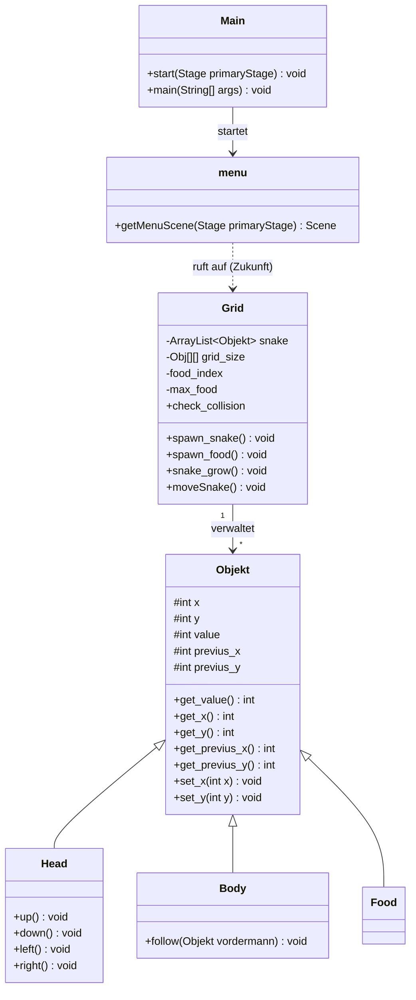
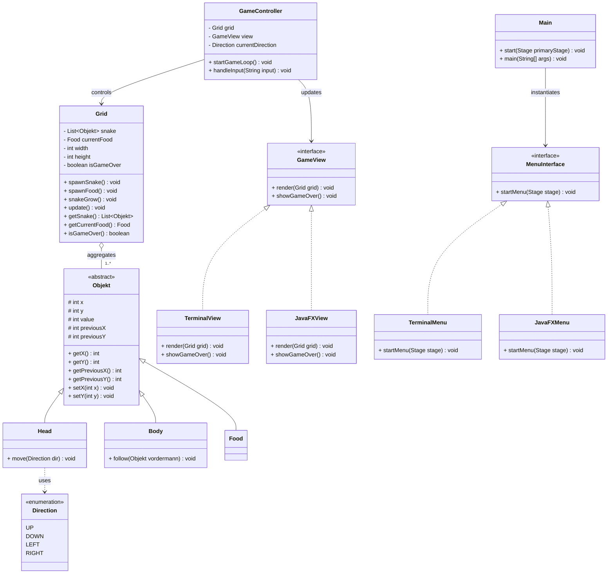
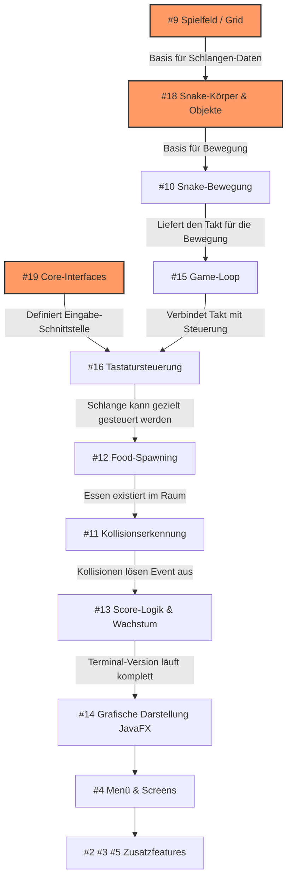
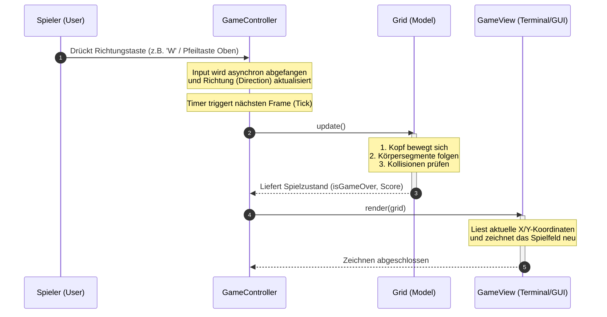
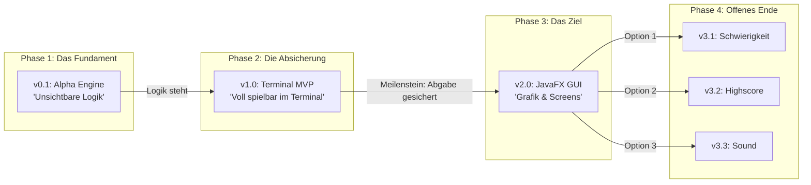
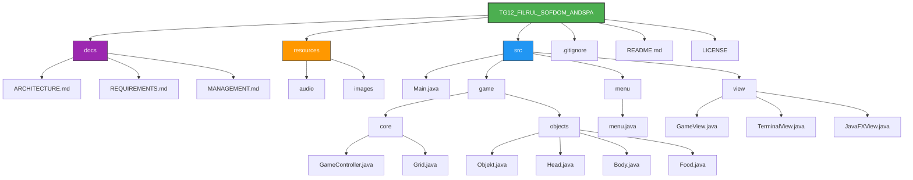

# Software-Architektur
Dieses Dokument beschreibt die Klassenstruktur und die Aufteilung unseres Snake-Spiels in drei logische Schichten (Model-View-Controller).
Um dieses Markdown richtig zusehen werden diese Shritte benötigt:
1. Markdown Preview Mermaid Support - Extension herunterladen.
2. Mit `Strg + Shift + V` (Windows) oder `Cmd + Shift + V` (Mac) öffnen.

## Jetzige Software-Architektur
### Klassendiagramm
Klassendiagramm der jetzigen Projektversion.

## Finale Software-Architektur

### Klassendiagramm
Klassendiagramm der finalen Projektversion.
Wurde von AI verbessert! (Ist nicht komplett).

## Technischer Arbeitsablauf & Abhängigkeiten (Development Pipeline)

## Dynamischer Programmablauf (Runtime Sequence)
Der zeitliche Ablauf des Spiels ist streng taktgesteuert (Tick-basiert) und wird vollständig vom `GameController` koordiniert. Dadurch wird eine saubere Synchronisation zwischen Benutzereingabe, physikalischer Berechnung und grafischer Anzeige erzwungen.

### Der detaillierte Takt-Zyklus (Game Loop Step)
Jeder einzelne Spielschritt durchläuft deterministisch die folgenden vier Phasen:

## Inkrementeller Release-Plan (Versions-Roadmap)

## Ordnerstruktur

