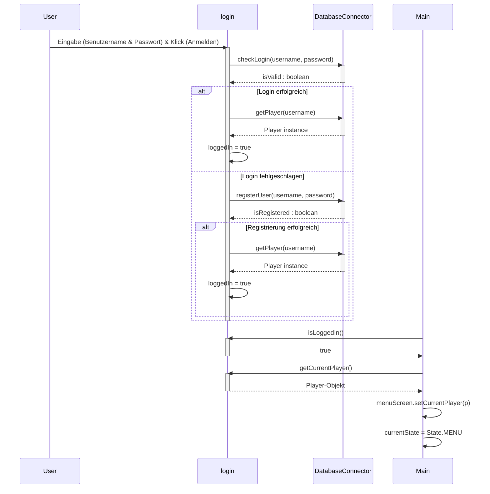
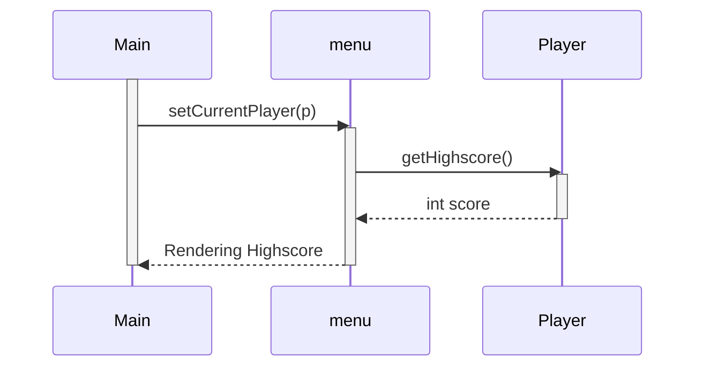
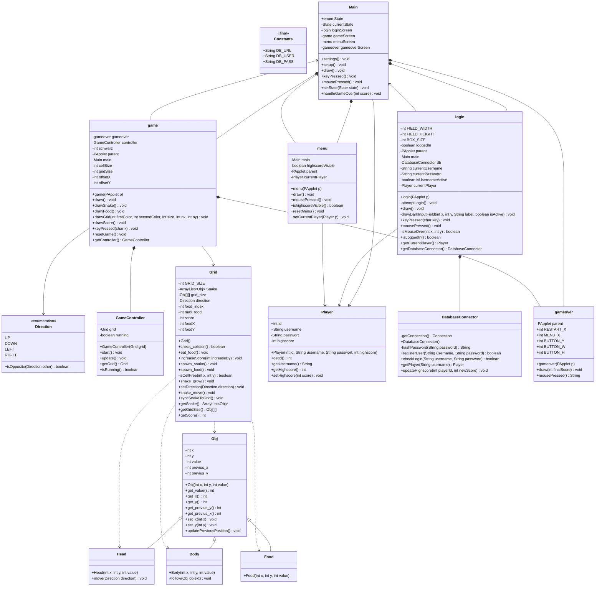

# Software-Architektur
Dieses Dokument beschreibt die Klassenstruktur und die Aufteilung unseres Snake-Spiels in drei logische Schichten (Model-View-Controller).
Um dieses Markdown richtig zusehen werden diese Shritte benötigt:
1. Markdown Preview Mermaid Support - Extension herunterladen.
2. Mit `Strg + Shift + V` (Windows) oder `Cmd + Shift + V` (Mac) öffnen.

## Sequenzdiagram Login eines Spielers

```mermaid
sequenceDiagram
    participant U as User
    participant LV as login
    participant DB as DatabaseConnector
    participant M as Main
    
    U->>LV: Eingabe (Benutzername & Passwort) & Klick (Anmelden)
    activate LV
    
    LV->>DB: checkLogin(username, password)
    activate DB
    DB-->>LV: isValid : boolean
    deactivate DB

    alt Login erfolgreich
        LV->>DB: getPlayer(username)
        activate DB
        DB-->>LV: Player instance
        deactivate DB
        LV->>LV: loggedIn = true
    else Login fehlgeschlagen
        LV->>DB: registerUser(username, password)
        activate DB
        DB-->>LV: isRegistered : boolean
        deactivate DB
        alt Registrierung erfolgreich
            LV->>DB: getPlayer(username)
            activate DB
            DB-->>LV: Player instance
            deactivate DB
            LV->>LV: loggedIn = true
        end
    end
    
    deactivate LV
    
    M->>LV: isLoggedIn()
    activate LV
    LV-->>M: true
    deactivate LV
    
    M->>LV: getCurrentPlayer()
    activate LV
    LV-->>M: Player-Objekt
    deactivate LV
    
    M->>M: menuScreen.setCurrentPlayer(p)
    M->>M: currentState = State.MENU
```

## Sequenzdiagramm Anzeige Highscore

```mermaid
sequenceDiagram
    participant M as Main
    participant MN as menu
    participant P as Player

    activate M
    M->>MN: setCurrentPlayer(p)
    activate MN
    MN->>P: getHighscore()
    activate P
    P-->>MN: int score
    deactivate P
    MN-->>M: Rendering Highscore

    deactivate M
    deactivate MN
```

### UML-Klassendiagramm

```mermaid
classDiagram
    %% Core
    class Constants {
        <<final>>
        +String DB_URL
        +String DB_USER
        +String DB_PASS
    }

    class Direction {
        <<enumeration>>
        UP
        DOWN
        LEFT
        RIGHT
        +isOpposite(Direction other) boolean
    }

    class GameController {
        -Grid grid
        -boolean running
        +GameController(Grid grid)
        +start() void
        +update() void
        +getGrid() Grid
        +isRunning() boolean
    }

    class Grid {
        -int GRID_SIZE
        -ArrayList~Obj~ Snake
        -Obj[][] grid_size
        -Direction direction
        -int food_index
        -int max_food
        -int score
        -int foodX
        -int foodY
        +Grid()
        +check_colision() boolean
        +eat_food() void
        +increaseScore(int increaseBy) void
        +spawn_snake() void
        +spawn_food() void
        -isCellFree(int x, int y) boolean
        +snake_grow() void
        +setDirection(Direction direction) void
        +snake_move() void
        +syncSnakeToGrid() void
        +getSnake() ArrayList~Obj~
        +getGridSize() Obj[][]
        +getScore() int
    }

    %% Objects
    class Obj {
        -int x
        -int y
        -int value
        -int previus_x
        -int previus_y
        +Obj(int x, int y, int value)
        +get_value() int
        +get_x() int
        +get_y() int
        +get_previus_y() int
        +get_previus_x() int
        +set_x(int x) void
        +set_y(int y) void
        +updatePreviousPosition() void
    }

    class Head {
        +Head(int x, int y, int value)
        +move(Direction direction) void
    }

    class Body {
        +Body(int x, int y, int value)
        +follow(Obj objekt) void
    }

    class Food {
        +Food(int x, int y, int value)
    }

    class Player {
        ~int id
        ~String username
        -String passwort
        -int highscore
        +Player(int id, String username, String passwort, int highscore)
        +getId() int
        +getUsername() String
        +getHighscore() int
        +setHighscore(int score) void
    }

    %% View (Ausschnitt)
    class Main {
        +enum State
        -State currentState
        -login loginScreen
        -game gameScreen
        -menu menuScreen
        -gameover gameoverScreen
        +settings() void
        +setup() void
        +draw() void
        +keyPressed() void
        +mousePressed() void
        +setState(State state) void
        +handleGameOver(int score) void
    }

    class DatabaseConnector {
        -getConnection() Connection
        +DatabaseConnector()
        -hashPassword(String password) String
        +registerUser(String username, String password) boolean
        +checkLogin(String username, String password) boolean
        +getPlayer(String username) Player
        +updateHighscore(int playerId, int newScore) void
    }

    class login {
        -int FIELD_WIDTH
        -int FIELD_HEIGHT
        -int BOX_SIZE
        -boolean loggedIn
        -PApplet parent
        -Main main
        -DatabaseConnector db
        -String currentUsername
        -String currentPassword
        -boolean isUsernameActive
        -Player currentPlayer
        +login(PApplet p)
        -attemptLogin() void
        +draw() void
        -drawDarkInputField(int x, int y, String label, boolean isActive) void
        +keyPressed(char key) void
        +mousePressed() void
        -isMouseOver(int x, int y) boolean
        +isLoggedIn() boolean
        +getCurrentPlayer() Player
        +getDatabaseConnector() DatabaseConnector
    }

    class menu {
        -Main main
        -boolean highscoreVisible
        -PApplet parent
        -Player currentPlayer
        +menu(PApplet p)
        +draw() void
        +mousePressed() void
        +ishighscoreVisible() boolean
        +resetMenu() void
        +setCurrentPlayer(Player p) void
    }

    class game {
        -gameover gameover
        -GameController controller
        -int schwarz
        -PApplet parent
        -Main main
        -int cellSize
        -int gridSize
        -int offsetX
        -int offsetY
        +game(PApplet p)
        +draw() void
        +drawSnake() void
        +drawFood() void
        +drawGrid(int firstColor, int secondColor, int size, int nx, int ny) void
        +drawScore() void
        +keyPressed(char k) void
        +resetGame() void
        +getController() GameController
    }

    class gameover {
        -PApplet parent
        +int RESTART_X
        +int MENU_X
        +int BUTTON_Y
        +int BUTTON_W
        +int BUTTON_H
        +gameover(PApplet p)
        +draw(int finalScore) void
        +mousePressed() String
    }

    %% Vererbungsstruktur
    Obj <|-- Head
    Obj <|-- Body
    Obj <|-- Food

    %% Obj
    Grid ..> Obj
    Grid ..> Head
    Grid ..> Food
    Grid ..> Body

    %% Grid
    Main --> Player
    Main *-- login
    Main *-- menu
    Main *-- game
    Main *-- gameover

    %% game
    game *-- gameover
    game *-- GameController
    game --> Main
    game --> Direction
    game --> Grid

    %% login
    login *-- DatabaseConnector
    login --> Main
    login --> Player

    %% menu
    menu --> Main
    menu --> Player
```

